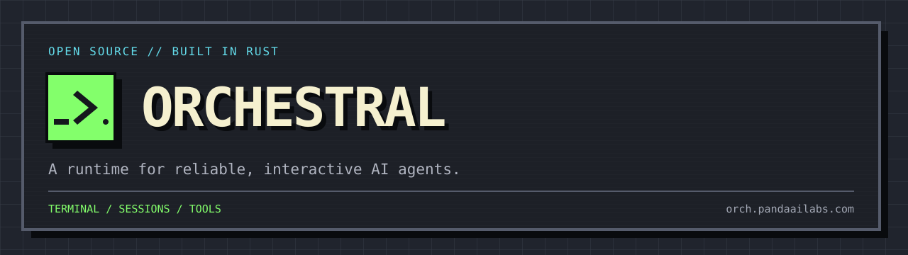

<p align="center"></p>

**A runtime for reliable, interactive AI agents.**

Read code, edit files, run tools, and keep working in the same conversation. Use a cloud
model or connect to Ferrum locally. Orchestral gives you a terminal UI, a headless CLI,
a browser control client, and a Rust SDK.

**Agents are the new processes. Orchestral is the runtime.**

[Website](https://orch.pandaailabs.com) · [中文](README.zh-CN.md) ·
[Install](#install) · [Quick start](#quick-start) · [SDK](#sdk)

## What you can do

- **Work in your project.** Read and edit files, run commands, and use project instructions.
- **Stay involved.** Inspect tool activity, answer questions, review approvals, steer, or cancel.
- **Continue later.** Browse and resume recorded sessions, with original history retained through context compaction.
- **Choose your model.** Use supported cloud providers or your own OpenAI-compatible endpoint.
- **Add context and tools.** Load workspace skills and connect MCP tools through the same guarded runtime.
- **Use the interface that fits.** Work in the terminal, pipe a headless response, or pair a browser with your host.

## Install

**v0.3.0 is being prepared.** Build from source until the public binary release is available:

```sh
git clone https://github.com/sizzlecar/orchestral.git
cd orchestral
cargo install --locked --path apps/orchestral-cli
orchestral --version
```

The repository pins Rust 1.91.0. The executable is `orchestral`; the browser client is
embedded, so normal builds need no Node.js or Dioxus CLI.

After the release is published, the binary installers will be available:

```sh
# macOS / Linux
curl -fsSL https://orch.pandaailabs.com/install.sh | sh
```

```powershell
# Windows PowerShell
irm https://orch.pandaailabs.com/install.ps1 | iex
```

The installers verify SHA-256 checksums and install into your user directory. Re-run the
installer to upgrade. See [release downloads](https://github.com/sizzlecar/orchestral/releases)
and [installation, rollback, and uninstall](RELEASING.md#installers).

| Platform | Command execution |
| --- | --- |
| macOS Apple Silicon / Intel | Native Seatbelt sandbox |
| Linux x64, glibc 2.35+ | Requires `bubblewrap` and unprivileged user namespaces |
| Windows x64 | Native commands require approval; use WSL for sandboxed commands |

On Ubuntu, install `bubblewrap` with `sudo apt-get install bubblewrap`. Native Windows
supports Streamable HTTP MCP; local stdio MCP requires WSL.

The 0.3 series is pre-1.0. APIs and recovery identities may change; check the
[release notes](CHANGELOG.md) before upgrading.

## Quick start

Open a terminal in your project. To use an OpenAI cloud model:

```sh
export OPENAI_API_KEY="your-api-key"
orchestral
```

In PowerShell, use `$env:OPENAI_API_KEY="your-api-key"`. To run one headless turn:

```sh
orchestral "Trace how requests reach the database in this project"
```

### Connect to local Ferrum

With Ferrum serving a tool-capable model at `http://127.0.0.1:8000`, connect directly:

```sh
orchestral --base-url http://127.0.0.1:8000/v1
```

The same option works with other OpenAI-compatible servers. A server root, `/v1` base,
or full `/chat/completions` endpoint is accepted. If the server lists one model,
Orchestral selects it; otherwise add `--model your-model-id`.

Custom URLs default to no authentication and do not inherit your cloud key. For a gateway
that requires authentication, set a dedicated key and select its environment variable:

```sh
orchestral --base-url https://gateway.example/v1 --model your-model-id --api-key-env LOCAL_MODEL_API_KEY
```

`OPENAI_BASE_URL` and `OPENAI_MODEL` provide the same connection shortcuts. Explicit CLI
values take precedence. The server and model must support tool calling for coding actions.

Check your configuration or connection without generating a response:

```sh
orchestral doctor
orchestral --base-url http://127.0.0.1:8000/v1 doctor --check-connection
```

Plain `doctor` is offline; `doctor --json` omits credential values. For provider profiles,
MCP, skills, and workspace policy, see the [configuration example](configs/orchestral.cli.yaml).

## Everyday use

| Command | Purpose |
| --- | --- |
| `orchestral` | Start the interactive TUI when stdin and stdout are terminals |
| `orchestral "your request"` | Run one headless turn |
| `orchestral sessions list` | Find sessions in the current workspace |
| `orchestral sessions show SESSION_ID` | Read the original conversation and tool results |
| `orchestral resume --last` | Continue the latest session in this workspace |
| `orchestral resume --last "Continue verification"` | Send a headless follow-up |

Headless stdout contains the final answer; progress and errors go to stderr.
Use `-C /path/to/project` to select a workspace and `--add-dir` for additional directories.

In the TUI, Enter sends or answers; Ctrl+J inserts a newline. `/` or F1 opens commands,
`@` completes workspace paths, and Ctrl+O expands tool records. `/model`, `/new`, and
`/resume` switch models or sessions while idle. `/context` shows loaded instructions and
context records; `/skills` lists discovered skills. See the [TUI guide](docs/product/tui-experience-v1.md).

Orchestral discovers `AGENTS.override.md`, `AGENTS.md`, or `CLAUDE.md` along the workspace
path. More specific instructions follow ancestor instructions. Skills add context;
tool permissions remain controlled by the host.

Session journals preserve original messages and tool records through compaction.
Recovery avoids repeating committed tool effects and keeps uncertain effects explicit.
See [session context and recall](docs/agent-foundation/session-context-v1.md) for the
recovery contract and compatibility limits.

## Mobile control PWA

`orchestral serve` hosts an embedded browser client using the same agent runtime.
To pair a browser with a local host:

```sh
orchestral serve --pair -C /path/to/project
```

Use your existing model configuration or pass the same connection options as the CLI.
For a phone, put the host behind trusted HTTPS and set `--public-url https://agent.example.com`.
Scan the pairing QR code to open a session, inspect tools, answer approval requests,
steer, or cancel from your browser. Model credentials and workspace access stay on the host.

<details>
<summary>Use an authenticated gateway</summary>

For an identity-aware reverse proxy, the host can verify signed RS256 JWT assertions
instead of issuing browser pairing credentials:

```sh
orchestral serve --public-url https://agent.example.com \
  --access-jwt-issuer https://access.example.com \
  --access-jwt-jwks-url https://access.example.com/.well-known/jwks.json \
  --access-jwt-audience orchestral \
  --access-jwt-header X-Access-JWT \
  --access-jwt-required-claim email=owner@example.com \
  -C /path/to/project
```

Configure these values for your gateway. The host checks the signature, issuer, audience,
expiry, and required claims on protected requests. Keep the origin behind your trusted
HTTPS proxy. This mode uses the proxy's browser session and does not use `--pair`.

</details>

See [deployment assets](deploy/README.md) and the [web guide](web/orchestral-web/README.md)
for optional infrastructure and browser development.

## SDK

Embed the same runtime in Rust. `AgentClient` starts runs; `AgentRunHandle` provides
events, inspection, input, steering, cancellation, and terminal results.

```sh
cargo run -p orchestral-examples --example agent_session
```

The [complete example](examples/agent_session.rs) composes a model backend, agent provider,
controller, and client without binding the application to a provider's wire format.

## Runtime

The current runtime is single-agent, with a shared model/tool loop, durable sessions,
guarded tools, and interactive control. Its optional Plan/DAG workflow runs inside
that agent; multi-agent scheduling is not implemented.

A recorded delivery means the agent produced an answer. Task correctness still needs
verification through tests or other evidence.

```text
Terminal / Headless / Browser / SDK
                 │
          AgentController
                 │
       Model ↔ Guarded tools
                 │
       Durable session and run journals
```

Contracts: [Agent](docs/agent-foundation/agent-protocol-v1.md) ·
[Model](docs/agent-foundation/model-protocol-v1.md) ·
[Tools](docs/agent-foundation/tool-runtime-v1.md) ·
[Artifacts](docs/agent-foundation/tool-artifact-v1.md) ·
[Skills](docs/agent-foundation/skill-runtime-v1.md) ·
[MCP tools](docs/agent-foundation/mcp-tools-adapter-v1.md).
MCP support currently covers tools, not resources or prompts.

## Development

Core contracts and runtime live in `core/`; concrete integrations live in `plugins/`.
The CLI is in `apps/orchestral-cli/`, the browser client in `web/orchestral-web/`, and
protocol and task evaluation tools in `testing/`.

```sh
cargo build --locked --workspace
cargo test --locked --workspace --all-targets
cargo fmt --all -- --check
cargo clippy --locked --workspace --all-targets --all-features -- -D warnings
```

See [AGENTS.md](AGENTS.md) for repository conventions and [RELEASING.md](RELEASING.md)
for packaging and release checks.

## Coding task evaluation

The [Harbor adapter](testing/orchestral-harbor/README.md) runs standard terminal tasks with
their verifiers. The local coding evaluation suite supplies controlled regression tasks:

```sh
cargo run -p orchestral-coding-eval -- list
cargo run -p orchestral-coding-eval -- validate --repo .
```

`validate` checks task fixtures without calling a model. For a live evaluation, configure
an [agent invocation](testing/orchestral-coding-eval/agents/orchestral.example.json).
Reports distinguish task verification, agent completion, timeouts, and infrastructure
errors. Agent claims and zero-test runs do not count as successful validation.

## License

[MIT](LICENSE).
